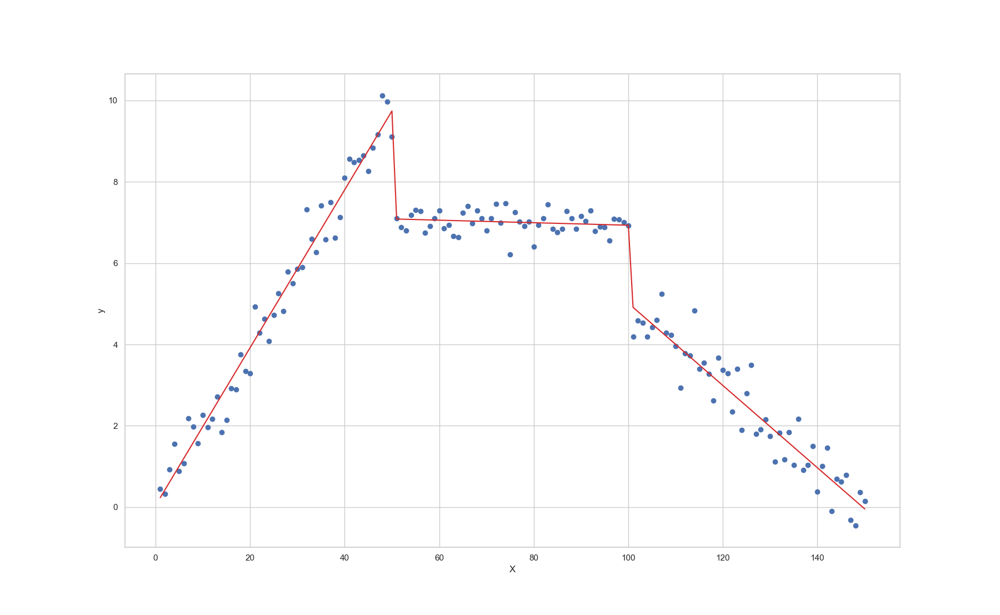
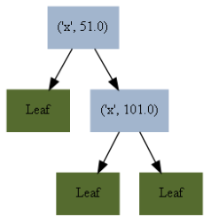

# Decision trees with multiple linear regression models

The file DecisionTree_LinearRegression.py contains the class LinearModelTree which is used to perform a decision tree algorithm with a linear regression model at the leaf nodes. 

### When to use this algorithm?

The purpose of this algorithm is to use a regular decision tree algorithm to build the tree and to use a linear regression model in each of the leaf nodes. In practice, we do not generally know apriori if the data is piecewise linear and even if we did, it is hard to determine the pivot points. If we decide the data to be piecewise linear either based on visualization or domain knowledge, we could use the linear model tree algorithm. A common example for this is the electricity demand forecasting. There is a piecewise linear relationship between temperature and electricity demand, depending on the seasons, hour of the day, and day of the week. 

### Get started

#### Clone the repo
```
git clone https://github.com/srpraveen97/Linear_model_tree.git
cd Linear_model_tree
```

#### Setup the virtual environment
```
pip install virtualenv
virtualenv venv  
venv\Scripts\activate
```

#### Install dependencies
```
pip install -r requirements.txt
```

### Run the code
```
python Examples/Example1.py
```

### Example-1

<a href="https://www.codecogs.com/eqnedit.php?latex=y&space;=&space;\left\{&space;\begin{array}{ll}&space;0.2x&space;&plus;&space;\epsilon_{1}&space;&&space;x\leq&space;50&space;\\&space;7&space;&plus;&space;&plus;&space;\epsilon_{2}&space;&&space;50&space;<&space;x\leq&space;100&space;\\&space;-0.1x&space;&plus;&space;15&space;&plus;&space;\epsilon_{3}&space;&&space;100&space;<&space;x\leq&space;150&space;\\&space;\end{array}&space;\right." target="_blank"></a>

```python
from DecisionTree_LinearRegression import LinearModelTree as lmt
```

```python
tree = lmt(reg_features=[0])
model = tree.fit(X_train,y_train)
```

```python
model.predict(X_test)
model.RMSE(X_test,y_test)
```


```python
g # A bad resolution plot within the IDE
g.view() # A high resolution PDF file
```


#### Work in progress...
1. Include metrics other than R-squared
2. Incorporate weighted regression models
